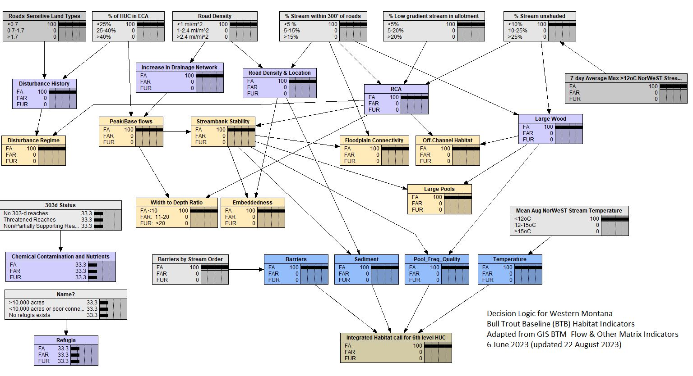

<!-- README.md is generated from README.Rmd. Please edit that file -->

```{r, include = FALSE}
knitr::opts_chunk$set(
  collapse = TRUE,
  comment = "#>",
  warning = FALSE, 
  message=FALSE
)
```


# btbr  

<!-- badges: start -->
[](https://lifecycle.r-lib.org/articles/stages.html#stable)
<!-- badges: end -->


The goal of {btbr} is to provide a reproducible package, model pipeline and documentation for the Western Montana Bull Trout Baseline (BTB) model. 
<figure>

<figcaption>Bull trout. (Photo courtesy of the U.S. Geological Survey)</figcaption>
</figure>  

<h2 style="color:red;">Attention!</h2> 

**Please read disclaimer and understand that this is in heavy development. Thank you!**  

## Installation  

You can install the development version of btbr from [GitHub](https://github.com/) with:

``` r
# install.packages("remotes")
remotes::install_github("soilwaterfish/btbr")
```

The package has some functionality beyond the BTB but is mostly for reproducing in a data pipeline using the  [{targets}](https://github.com/ropensci/targets) framework. The data pipeline provides reproducible workflows while in combination with the {btbr} package to generate a Bayesian Network model output.  

* You can see the {targets} style pipeline in the `_targets.R` script.  

<figure>

<figcaption>Bull Trout Baseline Bayesian Network with previous model logic.</figcaption>
</figure>

```{r disclaimer, child="DISCLAIMER.md", eval=TRUE}

```

 [
    
  ](https://creativecommons.org/publicdomain/zero/1.0/)

